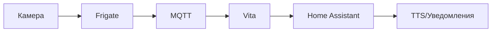
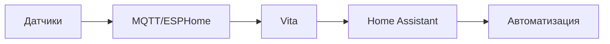

# Архитектура Vita

## Общая схема

```mermaid
graph TB
    A[Edge-модули] --> B((MQTT / REST))
    B --> C[Центральный узел<br/>(Vita)]
    C --> D[Ответ]
    D --> E[TTS / HA / Telegram]
    
    subgraph EdgeModules[Edge-модули]
        A1[Orange Pi 5 Ultra<br/>Зрение: Frigate/YOLO]
        A2[Jetson Nano 2<br/>Зрение: CLIP/CV]
        A3[ESP32/Zigbee<br/>Сенсоры: Температура/Движение]
    end
    
    subgraph CentralNode[Центральный узел - Vita]
        C1[llama.cpp / AirLLM<br/>Мозг: Логика/Память]
        C2[Whisper<br/>Голос: STT]
        C3[Piper<br/>Голос: TTS]
        C4[SQLite/JSON<br/>Память: Данные/Контекст]
    end
    
    subgraph Automation[Автоматизация]
        E1[Home Assistant<br/>Сценарии/Управление]
        E2[Node-RED<br/>Визуальная логика]
    end
    
    A1 & A2 & A3 --> B
    B --> C1 & C2 & C3 & C4
    C1 & C2 & C3 & C4 --> E1 & E2
```

## Компоненты

### Центральный узел (Мозг)
- **Hardware**: mini‑PC или ноутбук (64-128GB RAM)
- **LLM Engine**: llama.cpp / AirLLM
- **Функции**: Логика, память, обработка естественного языка

### Edge-модули "Зрение"
- **Hardware**: Orange Pi 5 Ultra, Jetson Nano 2 (8-16GB RAM)
- **CV Engine**: Frigate, YOLO, CLIP
- **Функции**: Компьютерное зрение, детекция объектов

### Edge-модули "Сенсоры"
- **Hardware**: ESP32, Zigbee, BLE
- **Engine**: MQTT, ESPHome
- **Функции**: Сбор данных с датчиков, управление устройствами

### Автоматизация
- **Platform**: Home Assistant, Node‑RED
- **Функции**: Сценарии, уведомления, интеграции

## Пример взаимодействия

1. **Видеонаблюдение**: Frigate обнаруживает движение → MQTT сообщение
2. **Обработка события**: Vita получает событие → llama.cpp генерирует контекстный ответ
3. **Реакция**: Ответ отправляется в Home Assistant → TTS озвучивает уведомление

## Потоки данных

### Голосовой ассистент
```mermaid
graph LR
    A[Микрофон] --> B[Whisper STT]
    B --> C[Vita (LLM)]
    C --> D[Piper TTS]
    D --> E[Динамики]
```

### Видеоаналитика


### Сенсорные данные
